# Sports-Hub Application

Hi! _**Sports Hub**!_ is a simple and smart application for players to discover and join sports lessons across different clubs. The app brings together a complete list of clubs and their available lessons, making it easy for users to browse, choose, and enroll in the lessons that match their interests and skill levels.

---
🔗 [Live Demo](https://hamadbah.github.io/spaceman-project/)
---
## Application Guide

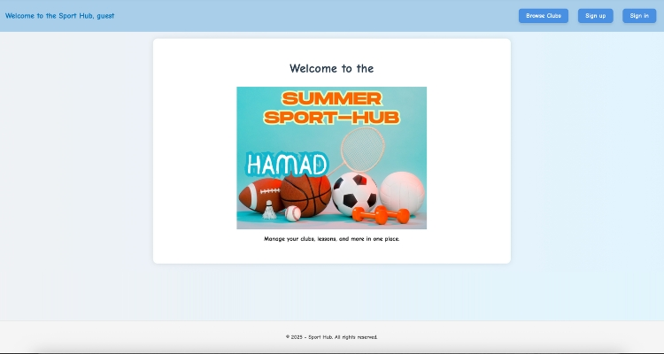

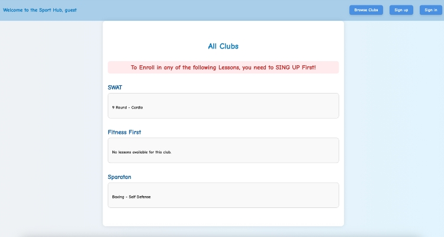

### Sign Up / Log In

- Create a new account either as a **Player** or an **Instructor**.
- Once Successfully account created, you can go through the app based on the privileges you have.

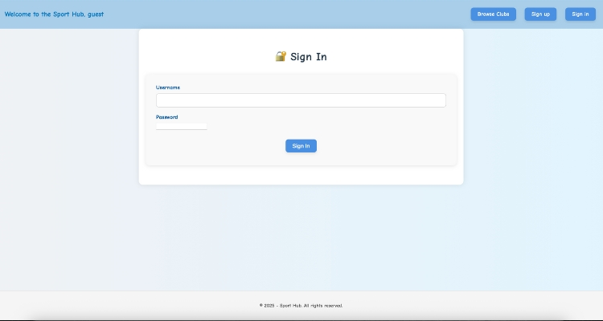

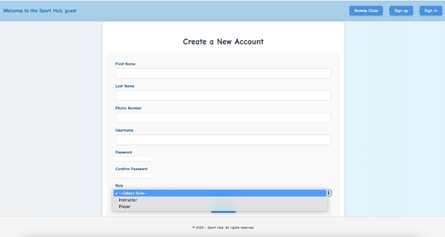
---

### ADMIN Login:

1. Create New club to the list.
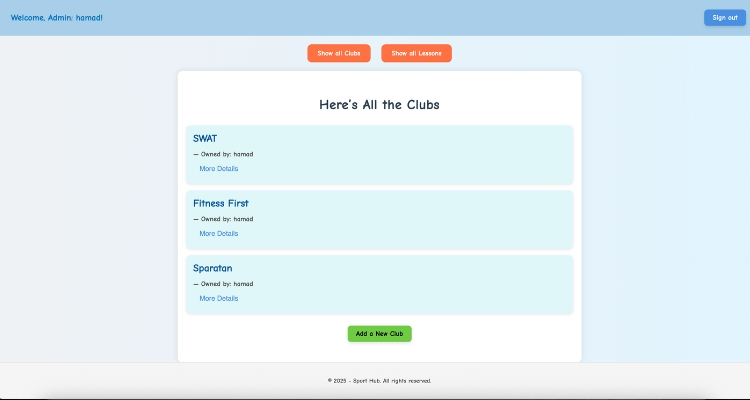
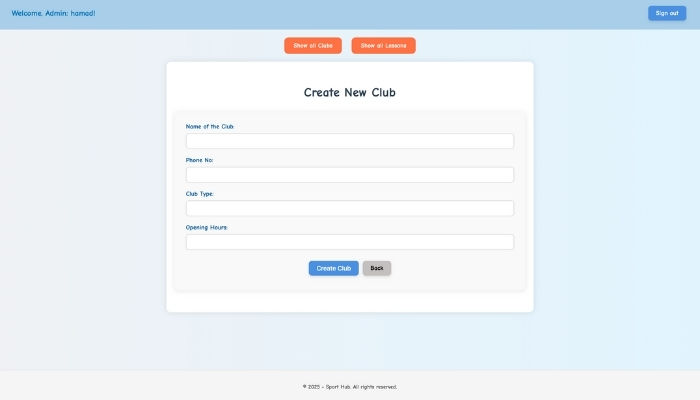
2. Edit, Update and Delete existing club.
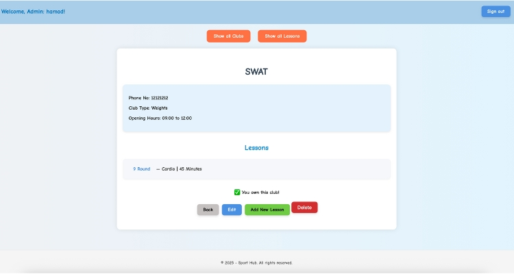
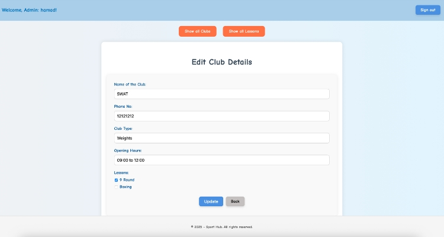
3. Add New Lessons to the list.
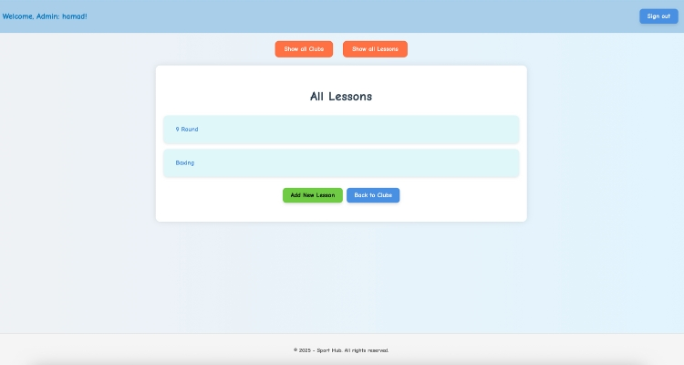
4. Assing the lesson to a club and instructors.
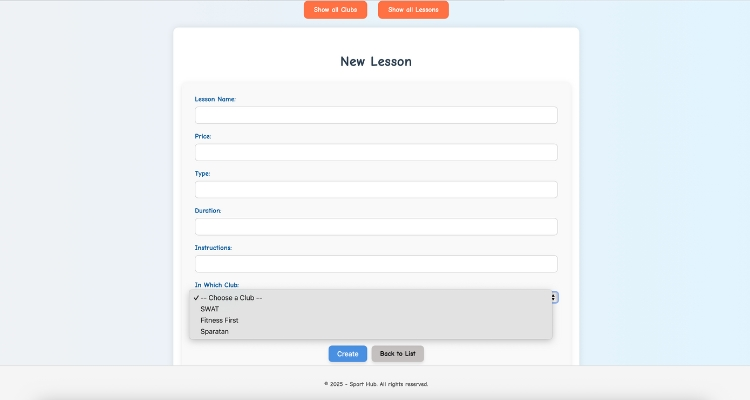
5. Edit, Update and Delete existing lesson.
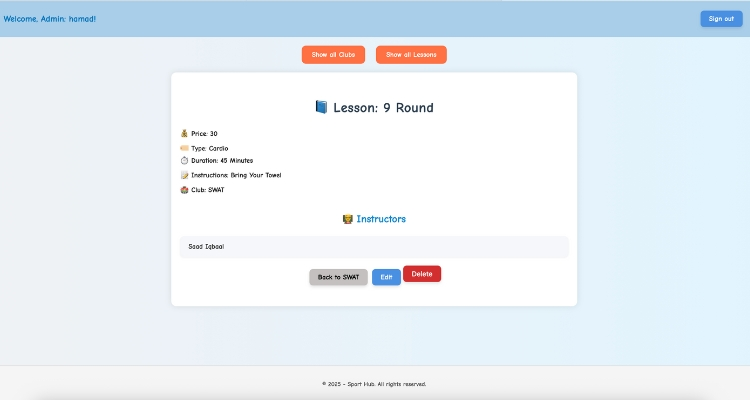
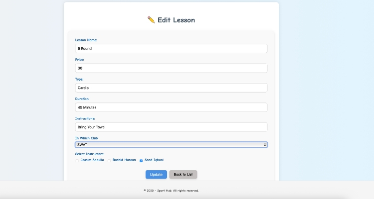

### Instructor Login:

1. View all the lessons under an instructor name and the enrolled players.
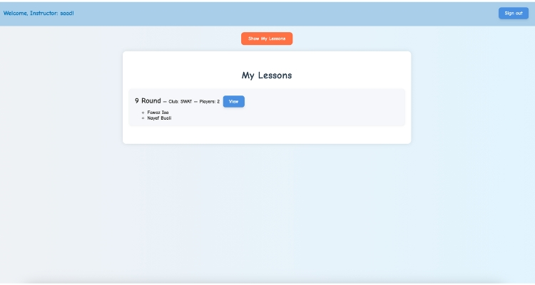

### Player Login:

1. View all the clubs and their lessons.
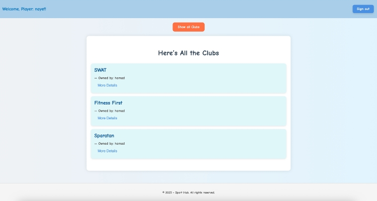
2. Choose a lesson to enroll or withdraw from it.
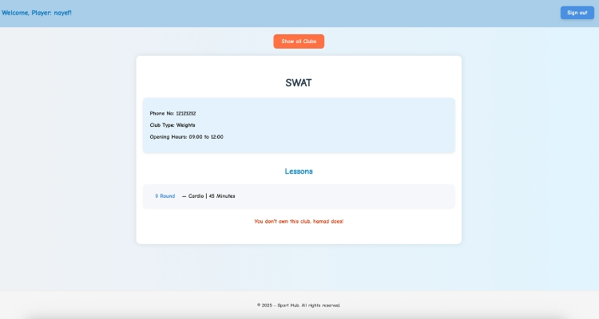
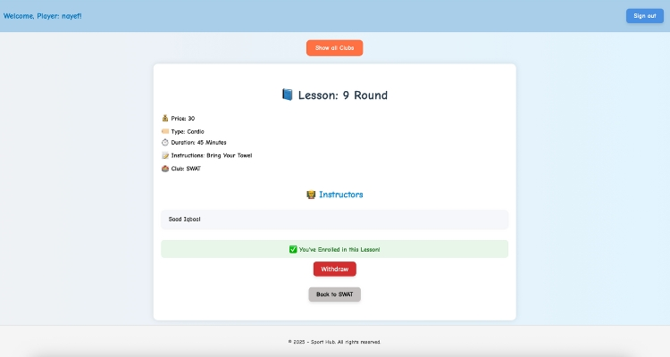

---

## Technologies Used in This Project

- _**EJS**_
- _**CSS**_
- _**JavaScript**_ as Language
- _**Express.js**_ as Framework
- _**MongoDB**_ as Database
- _**Middleware**_

---
## Online Resources

[Link to Regular Expression](https://developer.mozilla.org/en-US/docs/Web/JavaScript/Guide/Regular_expressions)

[Link to Array.isArray](https://developer.mozilla.org/en-US/docs/Web/JavaScript/Reference/Global_Objects/Array/isArray)

[Link to Set() Constructor](https://developer.mozilla.org/en-US/docs/Web/JavaScript/Reference/Global_Objects/Set/Set)

[Link to $in operator](https://www.mongodb.com/docs/manual/reference/operator/query/in/)

[Link to $ne operator](https://www.mongodb.com/docs/manual/reference/operator/query/ne/)

[Link to Optional chaining (?.)](https://developer.mozilla.org/en-US/docs/Web/JavaScript/Reference/Operators/Optional_chaining)

---

> I really enjoy developing this application and I hope you all get benefit from it!
